# Data collection mechanism for chronic cancers

## Introduction

While I was designing a clinical database for multiple myeloma for friend of mine, I tried to streamline my thought process and tried to formulate a standard procedure for designing such a database.

## Nature of diseases for which this database is applicable

1.  Chronic diseases which have **time frame** of few years.

2.  The disease process travels through one (and only one) of the many possible **states** at any given time. Death is a state from which the patient cannot come out.

3.  **Treatment** is in form of blocks at specified time intervals.

4.  **Measurement** occurs at multiple time points.

Timeline for a typical patient is as below:

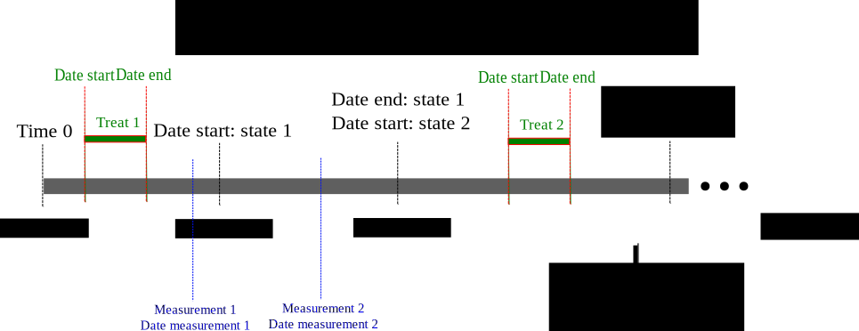

### States

The disease process is characterised by many states. States are well defined, are mutually exclusive and at a given time point, disease can be at only of the pre-defined states.  For example, states may be "initial disease", "partial remission", "complete remission", "relapse" and "death". A patient can travel from "initial disease" to "partial remission", then "relapse", then "complete remission" and finally "death".

### Treatment

The treatment typically involves multiple, well defined and repeated blocks of treatment protocols with "chemotherapy"", "surgery", "radiotherapy" and "stem cell transplantation" with "start date" and "end date" for each of the treatment protocols.

### Measurements

Time dependent measurements take place for clinical data (spleen, lymph node, liver, blood pressure) and investigations of all sorts. It can also accomodate complications related to treatment and related to disease.

## Database design

A database consists of many tables with relationship between them based on primary key of a table with foreign key of the second table.  Three tables are used as placeholders for options for "state", "measurement" and "treatment" variables respectively.

The present database was made with [Libreoffice Base](http://www.libreoffice.org/discover/base/), although any database manager could have been used.

### Patient details table

This is the primary table, holding details about patient identification, characteristics, contact details and date of first contact.  It has variables with only one value for each patient.

Structure of patient table may be viewed as:

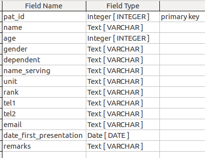

### State table

The purpose for this table is to provide options for states. If new state needs to be added or older state needs to be deleted, it is the place to do so.

Structure of state table may be viewed as:

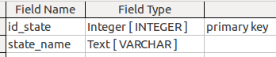

One possible set of options for state variable may be viewed as:

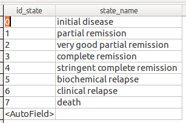

### Treatment table

The purpose for this table is to provide options for treatment protocols. If new treatment protocol needs to be added or older treatment protocol needs to be deleted, it is the place to do so.

Structure of treatment table may be viewed as:

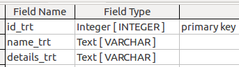

One possible set of options for treatment variable may be viewed as:

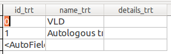

### Measurement table

The purpose for this table is to provide options for various [measurements](#measure). If new measurement variable needs to be added or older measurement variable needs to be deleted, it is the place to do so.

Structure of measurement table may be viewed as:

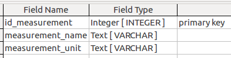

One possible set of options for measurement variable may be viewed as:

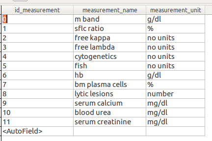

### Table holding state transition data for patients

This table holds data for state transition for each patient.  It is related to "patient table".  It has two fields: "State from" and "State to", which accomodates **only one** of the values given in [state table](#state).  It also have corresponding "date" fields, which should always be filled.  "State to" field will be kept empty, if a given patient is in a particular state and has not traversed to next state.

Structure of state table may be viewed as:

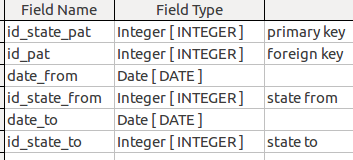

### Table holding treatment data for patients

This table holds data for treatment protocols received by each patient. It is related with "patient table".  It has a field, "Treatment Id", which accomodates **only one** of the values given in [treatment table](#treat).  "Date to" field may be kept empty till the time treatment protocol is not over. "Remarks" field hold any of the comments to be written in raw text format, which can be analysed later on.

Structure of the table may be viewed as:

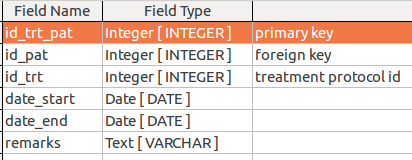

### Table holding measurement data for patients

This table holds data for measurements for each patient. Again, it is related to "patient table".

Structure of the table may be viewed as:

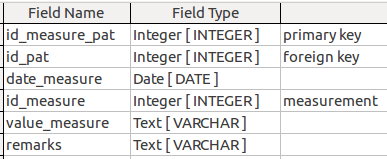

### Relationship between tables

The following figure depicts the relationship between tables:

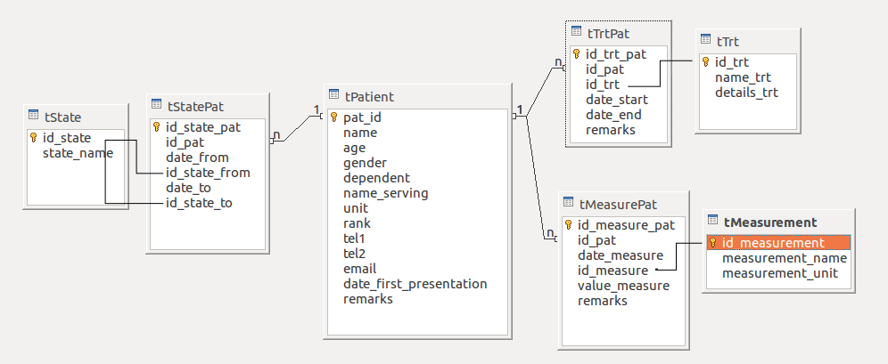

### Form for data entry

The following figure depicts the form for data entry:

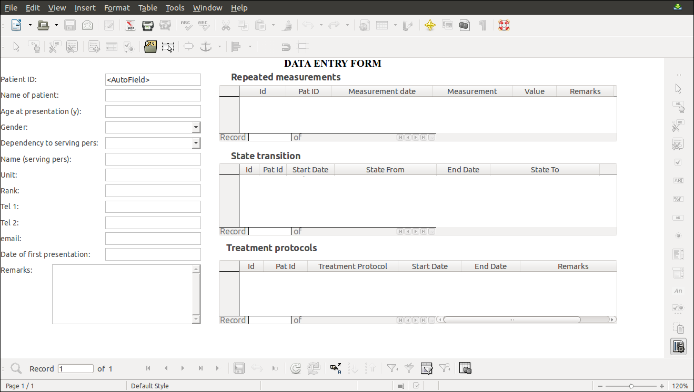

## Conclusion

The above database was prepared for Multiple Myeloma.  It can be easily extended to other forms of chronic malignancies like chronic lymphoproliferative diseases, acute myeloid leukemia, solid malignancies needing combination chemotherapies, etc.

This database provides with the basic framework on which many more modifications and additions can be done to make it more complete.

Best of Luck.
